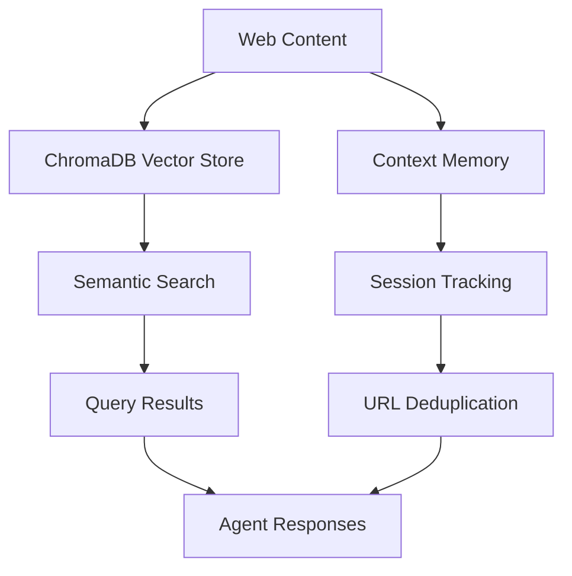

# Web Scraper with ChromaDB Memory

This example demonstrates a sophisticated web scraping agent that uses **ChromaDB** for persistent vector storage and semantic content search.

## Features Demonstrated

✅ **ChromaDB Integration** - Persistent vector storage that survives restarts  
✅ **Semantic Search** - Find content by meaning, not just keywords  
✅ **Context Isolation** - Separate scraping sessions and categories  
✅ **Memory Management** - Proper storage patterns and error handling  
✅ **Interactive CLI** - Test the agent with real-time commands  

## Key Components

### Memory System
- **ChromaDB Vector Storage** - Persistent embeddings for semantic search
- **Context Memory** - Session state tracking scraped URLs and categories
- **Working Memory** - Automatic conversation history tracking

### Actions
- `scrapeWebsite` - Extract and index website content
- `queryContent` - Semantic search across stored content  
- `getStorageStats` - Monitor ChromaDB usage and health
- `listScrapedUrls` - View session activity

### Context Design
- **Session Isolation** - Each session gets isolated state
- **Category Organization** - Group content by topic/domain
- **Memory Tracking** - Monitor scraped URLs, total scrapes, categories

## Running the Example

### Prerequisites
```bash
# Required
export ANTHROPIC_API_KEY="your-key-here"

# Optional (for better embeddings)
export OPENAI_API_KEY="your-openai-key"
```

### Start the Agent
```bash
cd examples/basic
bun run web-scraper-memory-agent.ts
```

### Try These Commands

**Scrape websites:**
```
scrape https://example.com/ai-news ai
scrape https://example.com/tech-trends technology  
scrape https://example.com/startup-funding business
```

**Search content semantically:**
```
search artificial intelligence
search funding patterns business
search future technology trends
```

**Monitor usage:**
```
stats
urls
help
```

## Memory Architecture



### Storage Strategy

1. **Vector Storage (ChromaDB)**
   - Full page content with embeddings
   - Metadata: URL, title, category, topics
   - Namespace isolation by category

2. **Context Memory (In-Memory)**
   - Scraped URL tracking (deduplication)
   - Session statistics and categories
   - Activity timestamps

3. **Working Memory (Automatic)**
   - Conversation history
   - Action calls and results
   - Agent reasoning traces

## Best Practices Shown

### ✅ Context Isolation
```typescript
// Each session gets isolated state
key: ({ sessionId }) => sessionId,
create: () => ({
  scrapedUrls: new Set<string>(),
  totalScrapes: 0,
  categories: new Set<string>(),
})
```

### ✅ Semantic Indexing
```typescript
// Store content with rich metadata
await ctx.agent.memory.vector.index([{
  id: documentId,
  content: `Title: ${content.title}\\n\\nContent: ${content.content}`,
  metadata: {
    url, title, category, topics, wordCount,
    sessionId: ctx.contextState.args.sessionId,
  },
  namespace: `scraper_${category}`,
}]);
```

### ✅ Error Handling
```typescript
// Graceful degradation with meaningful errors
try {
  const results = await ctx.agent.memory.vector.search(searchQuery);
  return { success: true, results };
} catch (error) {
  return { 
    success: false, 
    error: error instanceof Error ? error.message : String(error) 
  };
}
```

### ✅ Memory Monitoring
```typescript
// Track usage and health
const vectorCount = await ctx.agent.memory.vector.count();
const healthStatus = await ctx.agent.memory.vector.health();
```

## ChromaDB Configuration

The example uses the default ChromaDB configuration:

```typescript
const memory = createChromaMemory({
  collectionName: "web_scraper_content",
  metadata: {
    description: "Web scraping agent content storage",
    version: "1.0.0",
  },
});
```

### Advanced Configuration
```typescript
// Custom ChromaDB setup
const memory = createChromaMemory({
  path: "http://localhost:8000", // Remote ChromaDB
  collectionName: "my_collection",
  embeddingFunction: customEmbeddingFunction,
  auth: {
    provider: "basic",
    credentials: { username: "user", password: "pass" }
  }
});
```

## Extending the Example

### Add Real Web Scraping
Replace `mockScrapeWebsite` with actual scraping:
```typescript
import puppeteer from 'puppeteer';

async function realScrapeWebsite(url: string) {
  const browser = await puppeteer.launch();
  const page = await browser.newPage();
  await page.goto(url);
  
  const content = await page.evaluate(() => ({
    title: document.title,
    content: document.body.innerText,
  }));
  
  await browser.close();
  return content;
}
```

### Add Content Analysis
```typescript
action({
  name: "analyzeContent",
  description: "Analyze patterns in scraped content",
  handler: async ({}, ctx) => {
    const results = await ctx.agent.memory.vector.search({
      query: "main topics and themes",
      limit: 50,
    });
    
    // Analyze topics, sentiment, etc.
    return { insights: analysis };
  },
})
```

### Add Export Features
```typescript
action({
  name: "exportContent", 
  description: "Export scraped content to file",
  handler: async ({ format }, ctx) => {
    const results = await getAllContent();
    if (format === 'json') return JSON.stringify(results);
    if (format === 'csv') return convertToCSV(results);
    return results;
  },
})
```

This example shows production-ready patterns for building agents with persistent memory and semantic capabilities.