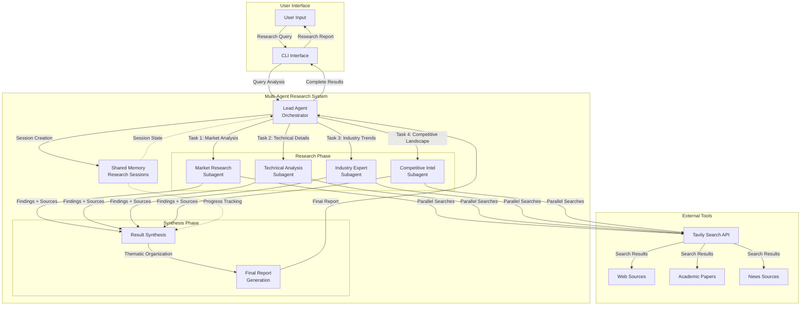

# Multi-Agent Research System

A sophisticated multi-agent research system built with Daydreams, implementing
the Claude-style orchestrated research architecture. This version focuses on a
clean, maintainable implementation of the core multi-agent concepts.

## Architecture Overview

This system implements the multi-agent research approach described in Claude's
research methodology, featuring:

### Core Components

1. **Lead Agent (Orchestrator)**

   - Decomposes complex queries into specialized subtasks
   - Creates and coordinates subagents with clear objectives
   - Synthesizes final results from all subagents
   - Uses extended thinking for strategic planning

2. **Research Subagents**

   - Specialized agents for specific research domains
   - Execute parallel searches with tool selection strategy
   - Use interleaved thinking for query refinement
   - Report findings back to lead agent

3. **Shared Memory System**

   - Cross-agent coordination and state management
   - Prevents duplicate work across subagents
   - Tracks research progress and session history

4. **Advanced Tool Integration**
   - Web search via Tavily with quality assessment
   - Parallel tool calling for performance
   - Dynamic tool selection based on query type

## System Architecture



## Key Features

### Smart Query Decomposition

- Automatically analyzes query complexity (simple/moderate/complex)
- Creates specialized research tasks with clear boundaries
- Prevents agent overlap and ensures comprehensive coverage

### Parallel Execution

- Subagents work simultaneously on different aspects
- Parallel search execution within each subagent
- Up to 90% faster than sequential approaches

### Quality Heuristics

- Source quality assessment and content farm detection
- Preference for primary sources over secondary
- Avoidance of SEO-optimized content

### Comprehensive Reporting

- Executive summaries with key findings
- Thematic organization of results
- Source attribution and confidence levels
- Recommendations for further research

## Usage

### Setup

1. Install dependencies:

```bash
cd examples/multi-agent-research
bun install
```

2. Set environment variables:

```bash
export ANTHROPIC_API_KEY="your-api-key"
export TAVILY_API_KEY="your-tavily-key"
```

### Running the System

```bash
bun run index.ts
```

### Example Queries

**Simple Research:**

```
"What is the current market cap of OpenAI?"
```

**Moderate Research:**

```
"Compare the performance of different large language models in 2025"
```

**Complex Research:**

```
"What are all the companies in the United States working on AI agents in 2025? Make a list of at least 100 companies with their websites, products, descriptions, and industry verticals."
```

## Available Actions

### `create-research-plan`

Analyzes a research query and creates a detailed research plan with specialized
subagent tasks.

**Parameters:**

- `query` (string): The research question or topic to analyze
- `maxSubagents` (number, optional): Maximum number of subagents (1-10,
  default: 5)

**Example:**

```
create-research-plan query="Research the semiconductor shortage impact on automotive industry" maxSubagents=4
```

### `delegate-research-task`

Delegates a specific research task to a specialized subagent.

**Parameters:**

- `sessionId` (string): The research session ID
- `role` (string): Subagent role (e.g., 'market_researcher',
  'technical_analyst')
- `objective` (string): Clear, specific research objective
- `outputFormat` (string): Required output format and structure
- `estimatedQueries` (number): Estimated number of queries (2-8, default: 4)

### `execute-research-searches`

Executes parallel web searches and synthesizes findings (used by subagents).

**Parameters:**

- `searchQueries` (array): 2-8 specific search queries to execute
- `synthesisInstructions` (string, optional): Additional synthesis instructions

### `synthesize-research-results`

Combines all subagent findings into a comprehensive final research report.

**Parameters:**

- `sessionId` (string): The research session ID to synthesize
- `reportStyle` (string, optional): "executive", "detailed", or "academic"
  (default: "detailed")

### `list-research-sessions`

Lists all active and recently completed research sessions.

### `get-research-results`

Retrieves detailed results from a specific research session.

**Parameters:**

- `sessionId` (string): ID of the research session

## Architecture Benefits

### Compared to Single-Agent Systems

**Traditional Approach:**

- Single agent handles all research aspects
- Sequential processing leads to bottlenecks
- Limited specialization and expertise
- Prone to information gaps and duplicated work

**Multi-Agent Approach:**

- Specialized agents with domain expertise
- Parallel processing for faster results
- Clear task boundaries prevent duplication
- Comprehensive coverage through coordination

### Research Quality Improvements

1. **Task Specialization**: Each subagent focuses on specific domains (market
   analysis, technical details, competitive landscape)

2. **Source Diversity**: Multiple agents explore different search strategies and
   source types

3. **Quality Control**: Built-in heuristics for source assessment and content
   filtering

4. **Comprehensive Synthesis**: Lead agent combines findings thematically rather
   than sequentially

## Technical Implementation

### Action-Based Architecture

This implementation uses discrete Daydreams actions instead of large
orchestration functions:

- **`create-research-plan`**: Analyzes queries and creates research plans
- **`delegate-research-task`**: Assigns tasks to specialized subagents
- **`execute-research-searches`**: Performs parallel web searches
- **`synthesize-research-results`**: Combines findings into reports

### Context Management

- `lead-agent`: Orchestrates research through action calls
- `subagent`: Executes specialized research tasks
- Shared memory for cross-agent coordination and session tracking

### Natural Flow

Rather than using `generateText` directly, the system leverages the agent's
natural conversation flow:

1. Agent calls `create-research-plan` action
2. Agent delegates tasks via `delegate-research-task`
3. Subagents execute searches using `execute-research-searches`
4. Agent synthesizes results via `synthesize-research-results`

This approach is more idiomatic to Daydreams and easier to maintain.

### Error Handling

- Graceful subagent failure recovery
- Fallback plans for parsing errors
- Timeout management for long-running tasks

## Prompting Strategy

Based on Claude's multi-agent research principles:

### Lead Agent Prompts

- **Think like your subagents**: Clear objectives and boundaries
- **Scale effort to complexity**: Appropriate resource allocation
- **Division of labor**: Prevent duplicate work

### Subagent Prompts

- **Tool selection heuristics**: Match tools to research intent
- **Start wide, then narrow**: Broad exploration before specifics
- **Source quality guidelines**: Prefer authoritative sources

### Quality Assessment

- **Content farm detection**: Identify and avoid SEO content
- **Source type classification**: Academic, news, official, etc.
- **Confidence scoring**: High/medium/low based on source quality

## Future Enhancements

### Planned Features

- [ ] Citation Agent for automated source verification
- [ ] Asynchronous subagent coordination
- [ ] Advanced tool selection based on query analysis
- [ ] Real-time progress reporting
- [ ] Research session resumption and extension

### Potential Integrations

- [ ] Academic paper search (arXiv, Google Scholar)
- [ ] Company database integration
- [ ] Real-time news feeds
- [ ] Document processing capabilities

## Comparison to Claude's System

This implementation follows Claude's research methodology:

✅ **Multi-agent orchestration** with lead agent coordination  
✅ **Parallel subagent execution** for speed improvements  
✅ **Task decomposition** with clear boundaries  
✅ **Quality heuristics** for source assessment  
✅ **Comprehensive synthesis** of findings  
✅ **Extended thinking** for planning phases

**Differences:**

- Simplified implementation for easier understanding and maintenance
- Basic source quality assessment with room for enhancement
- Synchronous coordination (asynchronous can be added later)

## Performance Characteristics

### Speed Improvements

- **Parallel subagents**: 3-5x faster than sequential processing
- **Parallel searches**: Up to 90% reduction in research time
- **Efficient synthesis**: Thematic rather than sequential organization

### Quality Metrics

- **Source diversity**: Multiple search strategies per query
- **Information coverage**: Specialized domain expertise
- **Reduced duplication**: Clear task boundaries
- **Confidence scoring**: Quality-weighted findings

## Contributing

This system serves as a reference implementation of multi-agent research
coordination in Daydreams. Contributions are welcome for:

- Enhanced source quality assessment
- Additional tool integrations
- Improved error handling
- Performance optimizations
- Extended citation capabilities

## License

This example is part of the Daydreams project and follows the same licensing
terms.
