# 🏦 Multi-Context Wallet Management Agent

A sophisticated cryptocurrency wallet management agent built with the Daydreams framework, demonstrating advanced context composition and multi-platform integration.

## Architecture Diagram

```mermaid
graph TD
    %% User Interfaces
    CLI[🖥️ CLI Interface] 
    Discord[🎮 Discord Bot]
    Telegram[📱 Telegram Bot] 
    Twitter[🐦 Twitter Bot]
    
    %% Main Agent
    Agent[🤖 Wallet Agent]
    
    %% Input/Output Layer
    TextInput[📥 Text Input]
    TextOutput[📤 Text Output]
    AlertOutput[🚨 Alert Output]
    
    %% Main Context - Orchestrator
    WalletContext[🏦 Wallet Agent Context<br/>Main Orchestrator]
    
    %% Composed Contexts
    AccountsContext[💼 Accounts Context<br/>Mock Wallets]
    CoinbaseContext[🏛️ Coinbase Context<br/>Real CDP Wallets]
    TasksContext[🤖 Tasks Context<br/>Automation Rules]
    AnalyticsContext[📊 Analytics Context<br/>User Tracking]
    
    %% Context Memory
    WalletMem[(🏦 Agent Memory)]
    AccountsMem[(💼 Accounts Memory)]
    CoinbaseMem[(🏛️ Coinbase Memory)]
    TasksMem[(🤖 Tasks Memory)]
    AnalyticsMem[(📊 Analytics Memory)]
    
    %% Actions
    AgentActions[🏦 Agent Actions]
    AccountActions[📋 Account Actions]
    CoinbaseActions[🏛️ Coinbase Actions]
    TaskActions[🤖 Task Actions]
    AnalyticsActions[📊 Analytics Actions]
    
    %% External Services
    CDP[🏛️ Coinbase CDP SDK]
    MockData[🎭 Mock Price Data]
    
    %% User Interfaces to Agent
    CLI --> Agent
    Discord --> Agent
    Telegram --> Agent
    Twitter --> Agent
    
    %% Agent Input/Output
    Agent --> TextInput
    Agent --> TextOutput
    Agent --> AlertOutput
    
    %% Main Context Composition
    Agent --> WalletContext
    WalletContext -.->|use| AccountsContext
    WalletContext -.->|use| CoinbaseContext  
    WalletContext -.->|use| TasksContext
    WalletContext -.->|use| AnalyticsContext
    
    %% Context to Memory
    WalletContext --> WalletMem
    AccountsContext --> AccountsMem
    CoinbaseContext --> CoinbaseMem
    TasksContext --> TasksMem
    AnalyticsContext --> AnalyticsMem
    
    %% Context to Actions
    WalletContext --> AgentActions
    AccountsContext --> AccountActions
    CoinbaseContext --> CoinbaseActions
    TasksContext --> TaskActions
    AnalyticsContext --> AnalyticsActions
    
    %% External Services
    CoinbaseContext --> CDP
    AccountsContext --> MockData
    
    %% Styling
    classDef interface fill:#e1f5fe,stroke:#01579b,stroke-width:2px
    classDef context fill:#f3e5f5,stroke:#4a148c,stroke-width:2px
    classDef memory fill:#e8f5e8,stroke:#1b5e20,stroke-width:2px
    classDef actions fill:#fff3e0,stroke:#e65100,stroke-width:2px
    classDef external fill:#ffebee,stroke:#b71c1c,stroke-width:2px
    
    class CLI,Discord,Telegram,Twitter interface
    class WalletContext,AccountsContext,CoinbaseContext,TasksContext,AnalyticsContext context
    class AccountsMem,CoinbaseMem,TasksMem,AnalyticsMem,WalletMem memory
    class AccountActions,CoinbaseActions,TaskActions,AnalyticsActions,AgentActions actions
    class CDP,MockData external
```



## Context Composition Architecture

The wallet agent uses Daydreams' **context composition pattern** where the main `WalletAgentContext` orchestrates multiple specialized contexts using the `.use()` method:

### 🏦 **WalletAgentContext** (Main Orchestrator)
- **Role**: Main entry point and user interaction coordinator
- **Memory**: User preferences, onboarding status, conversation state
- **Actions**: Price checking, trade simulation, help system, preferences
- **Composes**: All other contexts via `.use()` pattern

### 💼 **AccountsContext** (Mock/Simulation)
- **Role**: Local simulation accounts for testing and development
- **Memory**: Mock accounts, simulated balances, portfolio calculations
- **Actions**: Create accounts, check balances, simulate trades, portfolio summaries
- **Data Source**: Mock price data and simulated transactions

### 🏛️ **CoinbaseContext** (Real Wallets)
- **Role**: Real blockchain operations via Coinbase CDP SDK
- **Memory**: Real wallet data, addresses, network configurations
- **Actions**: Create wallets, fund via faucet, real transfers, asset trading
- **Data Source**: Coinbase CDP API and live blockchain data
- **Networks**: Testnet (base-sepolia, ethereum-sepolia) & Mainnet (base-mainnet, ethereum-mainnet)

### 🤖 **TasksContext** (Automation)
- **Role**: Conditional trading rules and automated execution
- **Memory**: Task definitions, execution history, condition monitoring
- **Actions**: Create tasks, check conditions, execute automation, manage rules
- **Features**: Price alerts, conditional trades, portfolio rebalancing

### 📊 **AnalyticsContext** (Tracking)
- **Role**: User behavior analysis and usage insights
- **Memory**: Events, sessions, interaction patterns, feature usage
- **Actions**: Track events, analyze patterns, export data, generate insights
- **Features**: Session management, engagement metrics, usage analytics

## Data Flow Architecture

### Input Processing Flow
```
1. User Input (CLI/Discord/Telegram/Twitter)
   ↓
2. Platform Interface (textInput/commandInput)
   ↓
3. Agent.send() → WalletAgentContext
   ↓
4. Context Composition via .use()
   • AccountsContext (mock wallets)
   • CoinbaseContext (real wallets) 
   • TasksContext (automation)
   • AnalyticsContext (tracking)
   ↓
5. LLM sees ALL actions from ALL contexts
   ↓
6. LLM orchestrates action calls based on user intent
   ↓
7. Actions execute in their respective contexts
   ↓
8. Results aggregate back to user via outputs
```

### Action Availability Matrix
| Context | Actions Available | When Active |
|---------|------------------|-------------|
| **WalletAgent** | get-current-prices, simulate-trade, set-user-preferences, get-help | Always (main context) |
| **Accounts** | create-account, get-balance, add-funds, get-portfolio-summary | Always (composed) |
| **Coinbase** | create-coinbase-wallet, fund-wallet-faucet, transfer-funds, trade-assets | Always (composed) |
| **Tasks** | create-task, list-tasks, check-tasks, toggle-task, delete-task | Always (composed) |
| **Analytics** | track-event, start-session, get-interaction-stats, export-analytics | Always (composed) |

### Context Isolation & Composition Benefits

**User Isolation**: Each `userId` gets completely separate context instances:
- `wallet-agent:alice` vs `wallet-agent:bob` 
- `accounts:alice` vs `accounts:bob`
- `coinbase:alice` vs `coinbase:bob`
- No data leakage between users

**Context Composition**: The `.use()` pattern provides:
- **Automatic Action Sharing**: All composed context actions available to main context
- **Isolated Memory**: Each context maintains separate memory stores
- **Unified Interface**: Single entry point with full functionality
- **Modular Design**: Easy to add/remove contexts without breaking functionality

## Input/Output Specifications

### Input Handlers
| Input Type | Schema | Purpose | Platforms |
|------------|--------|---------|-----------|
| **textInput** | `z.string()` | Natural language user messages | CLI, Discord, Telegram, Twitter |
| **commandInput** | `z.object()` | Structured commands with args | CLI, programmatic |

### Output Handlers  
| Output Type | Schema | Purpose | Platforms |
|-------------|--------|---------|-----------|
| **textOutput** | `z.string()` | Standard text responses to users | All platforms |
| **alertOutput** | `z.object()` | Priority alerts and notifications | All platforms |
| **tradeNotificationOutput** | `z.object()` | Trade execution notifications | All platforms |

### Platform-Specific Features
| Platform | Special Features | Input Methods | Output Formatting |
|----------|-----------------|---------------|-------------------|
| **CLI** | Interactive prompts, shortcuts | Command line, natural language | Plain text, colors |
| **Discord** | Slash commands, rich embeds | Mentions, DMs, slash commands | Rich embeds, reactions |
| **Telegram** | Inline keyboards, HTML formatting | Bot commands, buttons, natural language | HTML, inline keyboards |
| **Twitter** | Character limits, scheduled tweets | Mentions, DMs, replies | Tweet threads, truncation |

### Key Features

- **🏦 Account Management** - Create and manage multiple wallet accounts
- **🤖 Conditional Tasks** - Automate trading with price-based triggers
- **📊 Portfolio Analytics** - Track performance and user behavior
- **📱 Multi-Platform** - Discord, Telegram, Twitter/X integration
- **🔒 User Isolation** - Each user has completely separate wallet state
- **💰 Price Monitoring** - Real-time cryptocurrency price data
- **📈 Trade Simulation** - Test trades without actual execution

## Context Architecture Details

### AccountsContext
Manages wallet accounts, balances, and portfolio operations:
- Create/manage multiple accounts per user
- Track token balances and portfolio value
- Simulate trades and calculate outcomes
- Portfolio summaries and analytics

### TasksContext  
Handles conditional trading tasks and automation:
- Create price-based conditional tasks
- Monitor conditions and execute when met
- Task management (enable/disable/delete)
- Execution history and analytics

### AnalyticsContext
Tracks user behavior and provides insights:
- Record all user interactions and events
- Session management and activity tracking
- Usage pattern analysis and recommendations
- Export data in multiple formats

### WalletAgentContext (Main Composed Context)
Orchestrates all functionality using `.use()` pattern:
- Composes all other contexts automatically
- Provides unified instructions and behavior
- Handles onboarding and preferences
- Cross-context coordination

## Platform Integrations

### Discord Bot (`discord-wallet-bot.ts`)
- Slash commands: `/wallet balance`, `/wallet portfolio`, `/wallet tasks`
- Natural language in DMs: "Create an account called Trading Wallet"
- Rich embeds for portfolio and price information
- Private DM support for sensitive operations

### Telegram Bot (`telegram-wallet-bot.ts`)
- Bot commands: `/portfolio`, `/balance [token]`, `/prices`
- Inline keyboards for interactive navigation
- HTML formatting with emojis and structure
- Real-time alerts and notifications

### Twitter/X Bot (`twitter-wallet-bot.ts`)
- Mention responses: `@walletbot portfolio`, `@walletbot prices BTC,ETH`
- Direct messages for private wallet operations
- Scheduled market update tweets
- Character-optimized formatting for Twitter limits

## Installation & Setup

1. **Install Dependencies**
   ```bash
   cd examples/wallet-agent
   npm install
   ```

2. **Environment Variables**
   ```bash
   # Required for AI models
   export OPENAI_API_KEY="your-openai-key"
   export GROQ_API_KEY="your-groq-key"
   
   # Platform-specific (as needed)
   export DISCORD_TOKEN="your-discord-token"
   export TELEGRAM_BOT_TOKEN="your-telegram-token"  
   export TWITTER_USERNAME="your-twitter-username"
   export TWITTER_PASSWORD="your-twitter-password"
   export TWITTER_EMAIL="your-twitter-email"
   ```

3. **Environment Setup (for real Coinbase wallets)**
   ```bash
   # Optional: Set up Coinbase CDP API keys for real wallet operations
   export CDP_API_KEY_NAME="your-api-key-name"
   export CDP_API_KEY_PRIVATE_KEY="your-private-key"
   
   # Without keys, the system runs in mock mode automatically
   ```

4. **Run the CLI**
   ```bash
   # Start interactive CLI
   npm run cli
   
   # Quick start with demo data
   npm run quick-start
   
   # Demonstrate Coinbase CDP integration
   npm run coinbase-demo
   
   # Start with specific user ID
   npm run cli alice
   
   # Run platform-specific bots
   npm run discord-bot
   npm run telegram-bot  
   npm run twitter-bot
   ```

## Usage Examples

### Interactive CLI Commands

```bash
# Start the CLI
npm run cli

# Real Coinbase Wallet Commands:
wallet> Create a real Coinbase wallet called 'My Testnet Wallet'
wallet> Fund my wallet with testnet ETH
wallet> Check my Coinbase wallet balance
wallet> Transfer 0.001 ETH to 0x742d35Cc6634C0532925a3b8D03A23c14B3c7F3A
wallet> List all my Coinbase wallets

# Simulation Commands:
wallet> Create a mock account called 'Trading Portfolio' with 10 ETH and 5000 USDC
wallet> Simulate trading 1 ETH for USDC
wallet> Show me my portfolio summary

# General Commands:
wallet> What's the current ETH price?
wallet> Create a task to alert me when BTC goes above $70000
wallet> Show my analytics
wallet> help
wallet> exit
```

### Quick Shortcuts

The CLI includes several shortcuts for common operations:
- `portfolio` or `balance` - Show portfolio summary
- `prices` or `market` - Get current cryptocurrency prices  
- `tasks` - Show conditional tasks status
- `analytics` or `stats` - Display usage analytics
- `help` or `features` - Show all available features

### Programmatic Usage

```typescript
import { createWalletAgent, sendToWalletAgent } from './wallet-agent';

const agent = createWalletAgent();
await agent.start();

// Create account
await sendToWalletAgent(
  agent,
  "Create an account called 'Main Wallet' with 10 ETH and 5000 USDC",
  "user123",
  "cli"
);

// Check portfolio
await sendToWalletAgent(
  agent, 
  "Show me my portfolio summary",
  "user123",
  "cli"
);
```

### Conditional Tasks

```typescript
// Set up price alerts
await sendToWalletAgent(
  agent,
  "Create a task to alert me when ETH price goes above $4000",
  "user123", 
  "cli"
);

// Conditional trading
await sendToWalletAgent(
  agent,
  "Create a task to sell 2 ETH when the price hits $4500",
  "user123",
  "cli"
);

// Check task status
await sendToWalletAgent(
  agent,
  "Check all my tasks and execute any that meet conditions",
  "user123",
  "cli" 
);
```

### Multi-Platform Usage

```typescript
// Discord interaction
await sendToWalletAgent(agent, "What's my BTC balance?", "discord-user-123", "discord");

// Telegram interaction  
await sendToWalletAgent(agent, "Simulate trading 1 ETH for USDC", "telegram-user-456", "telegram");

// Twitter interaction
await sendToWalletAgent(agent, "Show current crypto prices", "twitter-user-789", "twitter");
```

## API Reference

### Core Actions

#### Account Management
- `create-account` - Create new wallet account
- `list-accounts` - Show all user accounts  
- `get-balance` - Check token balances
- `set-active-account` - Switch active account
- `add-funds` - Add tokens to account (mock)
- `get-portfolio-summary` - Complete portfolio overview

#### Task Management
- `create-task` - Create conditional trading task
- `list-tasks` - Show all user tasks
- `toggle-task` - Enable/disable task
- `delete-task` - Remove task
- `check-tasks` - Evaluate and execute tasks
- `get-task-details` - Get task information

#### Analytics & Insights
- `track-event` - Record user interaction
- `start-session` - Begin user session
- `end-session` - End user session  
- `get-interaction-stats` - User statistics
- `get-usage-patterns` - Behavior analysis
- `export-analytics` - Export data

#### Market Data
- `get-current-prices` - Current crypto prices
- `simulate-trade` - Test trade outcomes
- `get-market-summary` - Market overview
- `set-user-preferences` - Update user settings

## Context Memory Structures

### AccountsMemory
```typescript
interface AccountsMemory {
  accounts: WalletAccount[];
  activeAccountId?: string;
  totalPortfolioValue: number;
  lastUpdated: number;
}

interface WalletAccount {
  id: string;
  name: string;
  address: string;
  balances: Record<string, number>;
  createdAt: number;
  isActive: boolean;
}
```

### TasksMemory
```typescript
interface TasksMemory {
  tasks: ConditionalTask[];
  executionHistory: ExecutionRecord[];
  lastCheckTime: number;
}

interface ConditionalTask {
  id: string;
  name: string;
  condition: TaskCondition;
  action: TaskAction;
  isEnabled: boolean;
  executionCount: number;
  maxExecutions?: number;
}
```

### AnalyticsMemory
```typescript
interface AnalyticsMemory {
  events: AnalyticsEvent[];
  sessions: UserSession[];
  totalInteractions: number;
  dailyStats: Record<string, number>;
  featureUsage: Record<string, number>;
}
```

## Advanced Features

### Context Composition Benefits
- **Modular Design** - Each context handles specific functionality  
- **Automatic Integration** - Composed contexts share actions seamlessly
- **Isolated Memory** - Each context maintains separate state
- **Cross-Context Communication** - Contexts can interact when needed

### Multi-User Isolation
- Each user ID gets completely separate context instances
- `wallet-agent:user123` vs `wallet-agent:user456`
- No data leakage between users
- Scalable to thousands of users

### Episode Tracking
- Automatic conversation episode detection
- Rich episode metadata for analytics
- Episode classification and analysis
- Export capabilities for data analysis

### Real-Time Features
- Price monitoring and alerts
- Task condition evaluation
- Live portfolio updates  
- Multi-platform notifications

## Security & Safety

- **Simulation Mode** - No actual trading or transactions
- **Data Isolation** - Users cannot access others' data
- **Private Operations** - DM/private chat support
- **Rate Limiting** - Built-in abuse protection
- **Mock Data** - Uses simulated prices and accounts

## Development

### Project Structure
```
wallet-agent/
├── accounts-context.ts      # Account management context
├── tasks-context.ts         # Conditional tasks context  
├── analytics-context.ts     # User analytics context
├── wallet-agent-context.ts  # Main composed context
├── wallet-agent.ts          # Base agent implementation
├── discord-wallet-bot.ts    # Discord integration
├── telegram-wallet-bot.ts   # Telegram integration
├── twitter-wallet-bot.ts    # Twitter/X integration
├── examples.ts              # Usage examples
└── README.md               # This documentation
```

### Adding New Features
1. Add actions to relevant contexts
2. Update memory interfaces if needed
3. Test with base agent
4. Add platform-specific formatting
5. Update documentation

### Testing
```bash
# Run base agent tests
npm test

# Test individual platforms
npm run test:discord
npm run test:telegram
npm run test:twitter
```

## Key Learnings

This implementation demonstrates several advanced Daydreams patterns:

1. **Context Composition** - Using `.use()` to combine multiple contexts
2. **Multi-Platform Architecture** - Same agent across different interfaces
3. **State Management** - Isolated user state with shared functionality
4. **Episode Tracking** - Automatic conversation analysis and export
5. **Real-Time Operations** - Continuous monitoring and execution
6. **Type Safety** - Full TypeScript integration throughout

## Contributing

1. Fork the repository
2. Create feature branch: `git checkout -b feature/new-feature`
3. Add your changes with proper TypeScript types
4. Test across all platforms
5. Update documentation
6. Submit pull request

## License

This project is part of the Daydreams framework examples and follows the same licensing terms.