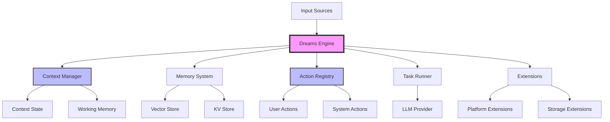

<p align="center">
  
</p>

<p align="center">
  <strong>Lightweight TypeScript Framework for Stateful AI Agents</strong>
</p>

<p align="center">
  <a href="https://docs.dreams.fun"></a>
  <a href="https://opensource.org/licenses/MIT"></a>
  <a href="https://www.typescriptlang.org/"></a>
  <a href="https://github.com/daydreamsai/daydreams/stargazers"></a>
  <a href="https://twitter.com/daydreamsagents"></a>
  <a href="https://discord.gg/rt8ajxQvXh"></a>
</p>

<p align="center">
  <a href="#-features">Features</a> •
  <a href="#-quick-start">Quick Start</a> •
  <a href="#-documentation">Docs</a> •
  <a href="#-examples">Examples</a> •
  <a href="#-contributing">Contributing</a>
</p>

---

> ⚠️ **Alpha Software**: This framework is under active development. APIs may
> change between versions.

## 🎯 What is Daydreams?

Daydreams is a **lightweight TypeScript framework** for building autonomous AI
agents with persistent state and multi-context capabilities. Built for both
**Node.js and browser** environments.

### Key Features:

- **🔄 Multi-Context System**: Manage multiple stateful conversations and agent
  contexts simultaneously
- **💾 Long-Running State**: Agents maintain memory and context across sessions,
  enabling complex multi-step workflows
- **🔌 Framework Agnostic**: Seamlessly integrates with LangChain, Vercel AI
  SDK, and other popular AI frameworks
- **🌐 Universal Compatibility**: Runs in Node.js, browsers, Deno, Bun, and edge
  runtimes
- **🪶 Lightweight Core**: Minimal dependencies, tree-shakeable
- **🤖 Any LLM Provider**: Works with OpenAI, Anthropic, Groq, local models, or
  any provider via adapters

## ✨ Features

### 📦 Developer Experience

- **TypeScript First**: Full type safety with excellent IntelliSense support
- **Simple API**: Intuitive context and action system
- **Modular Design**: Use only what you need
- **Framework Composition**: Combine with LangChain tools, Vercel AI SDK, or
  custom implementations
- **Streaming Support**: Real-time response streaming out of the box

### 🧠 Agent Capabilities

- **Stateful Contexts**: Maintain conversation history and agent state
- **Action System**: Define custom functions agents can execute
- **Memory Persistence**: Store and retrieve information across sessions
- **Task Management**: Handle complex multi-step operations
- **Event-Driven**: React to inputs from multiple sources

### 🔗 Platform Support

- **Multi-Platform**: Discord, Twitter, Telegram, CLI, and more via extensions
- **Blockchain Ready**: Optional modules for Web3 interactions
- **API Integration**: Connect to any REST or GraphQL API
- **Database Support**: Works with any database through adapters

## 🚀 Quick Start

### Prerequisites

- **Node.js** 18+ or modern browser environment
- **TypeScript** 4.5+ (optional but recommended)
- **LLM API Key** from any supported provider

### Installation

```bash
npm install @daydreamsai/core
# or
yarn add @daydreamsai/core
# or
pnpm add @daydreamsai/core
```

### Your First Agent

```typescript
import { createDreams, context } from "@daydreamsai/core";
import { anthropic } from "@ai-sdk/anthropic";
import { z } from "zod";

// Define a stateful context
const chatContext = context({
  type: "chat",
  schema: z.object({
    userId: z.string(),
  }),
  create() {
    return {
      messages: [],
      metadata: {},
    };
  },
});

// Create an agent with persistent state
const agent = await createDreams({
  model: anthropic("claude-3-5-sonnet-latest"),
  context: chatContext,
  actions: [
    // Define custom actions your agent can take
  ],
}).start({ userId: "user-123" });

// Send messages - state is maintained across calls
await agent.send({
  context: chatContext,
  args: { userId: "user-123" },
  input: {
    type: "text",
    data: "Remember that I prefer Python for data analysis",
  },
});
```

### Using with Other Frameworks

```typescript
// Works with LangChain
import { ChatOpenAI } from "@langchain/openai";
const agent = await createDreams({
  model: new ChatOpenAI({ modelName: "gpt-4" }),
  // ... rest of config
});

// Works with Vercel AI SDK
import { openai } from "@ai-sdk/openai";
const agent = await createDreams({
  model: openai("gpt-4-turbo"),
  // ... rest of config
});

// Works with any LLM provider
import { createCustomProvider } from "./my-provider";
const agent = await createDreams({
  model: createCustomProvider(),
  // ... rest of config
});
```

## 📚 Documentation

Visit our [comprehensive documentation](https://docs.dreams.fun) to learn more:

- **[Getting Started Guide](https://docs.dreams.fun/getting-started)** - Set up
  your first agent
- **[Core Concepts](https://docs.dreams.fun/concepts)** - Understand contexts,
  actions, and memory
- **[API Reference](https://docs.dreams.fun/api)** - Detailed API documentation
- **[Examples](https://docs.dreams.fun/examples)** - Learn from working code
- **[Integration Guide](https://docs.dreams.fun/integrations)** - Connect with
  other frameworks

## 🎨 Examples

Explore our example implementations:

| Example                                    | Description                                         | Location                  |
| ------------------------------------------ | --------------------------------------------------- | ------------------------- |
| [Basic Chat](examples/basic)               | Simple chat interface with personality traits       | `examples/basic/`         |
| [Discord Bot](examples/discord)            | Multi-functional Discord bot                        | `examples/discord/`       |
| [Twitter Agent](examples/twitter)          | Autonomous Twitter/X agent                          | `examples/twitter/`       |
| [Telegram Bot](examples/telegram)          | Telegram bot integration                            | `examples/telegram/`      |
| [Task Management](examples/tasks)          | Task planning and execution                         | `examples/tasks/`         |
| [Deep Research](examples/deep-research)    | Advanced research capabilities                      | `examples/deep-research/` |
| [Blockchain Interactions](examples/chains) | Cross-chain operations                              | `examples/chains/`        |
| [Game Agents](examples/games)              | Agents for on-chain games (Gigaverse, Lootsurvivor) | `examples/games/`         |
| [MCP Integration](examples/mcp)            | Model Context Protocol examples                     | `examples/mcp/`           |
| [Composio](examples/composio)              | Composio integration examples                       | `examples/composio/`      |

## 🏗️ Architecture

Daydreams uses a modular, event-driven architecture designed for flexibility and
composability:



### Core Components

- **Dreams Engine**: Lightweight orchestrator managing agent lifecycle and
  message flow
- **Context Manager**: Handles multiple concurrent stateful conversations with
  type safety
- **Memory System**: Pluggable storage layer supporting both KV and vector
  stores
- **Action Registry**: Type-safe action system for extending agent capabilities
- **Task Runner**: Manages async operations with concurrency control
- **Extensions**: Plugin architecture for platforms, storage, and custom
  features

## 🔗 Optional Extensions

### Blockchain Support

Daydreams can be extended with blockchain capabilities through optional
packages:

<p align="center"> 
  
  
  
  
  
  
</p>

### Platform Extensions

- `@daydreamsai/discord` - Discord bot integration
- `@daydreamsai/twitter` - Twitter/X automation
- `@daydreamsai/telegram` - Telegram bot support
- `@daydreamsai/cli` - Command-line interface

### Storage Extensions

- `@daydreamsai/supabase` - Supabase vector store
- `@daydreamsai/chroma` - ChromaDB integration
- `@daydreamsai/mongo` - MongoDB support

## 🤖 Supported Providers

Daydreams works with any LLM provider through the AI SDK adapters:

- **OpenAI** - GPT-4, GPT-3.5, etc.
- **Anthropic** - Claude 3.5, Claude 4, etc.
- **Google** - Gemini Pro, Gemini Ultra
- **Groq** - Fast inference for open models
- **OpenRouter** - Access multiple providers
- **Ollama** - Local model support
- **LangChain** - Use any LangChain model
- **Custom** - Bring your own provider

## 🤝 Contributing

We love contributions! Whether you're fixing bugs, adding features, or improving
documentation, we'd appreciate your help.

### How to Contribute

1. **Check existing issues** or create a new one to discuss your ideas
2. **Fork the repository** and create your branch from `main`
3. **Make your changes** and ensure tests pass
4. **Submit a pull request** with a clear description

See our [Contributing Guide](CONTRIBUTING.md) for detailed instructions.

### Development Setup

```bash
# Clone the repository
git clone https://github.com/daydreamsai/daydreams.git
cd daydreams

# Install dependencies
pnpm install

# Build packages in watch mode
pnpm build:packages --watch

# Run tests
pnpm test
```

### Good First Issues

New to the project? Check out our
[`good first issue`](https://github.com/daydreamsai/daydreams/issues?q=is%3Aissue+is%3Aopen+label%3A%22good+first+issue%22)
label for beginner-friendly tasks.

## 💬 Community

Join our growing community:

- **[Discord](https://discord.gg/daydreams)** - Chat with other developers
- **[Twitter](https://twitter.com/daydreamsagents)** - Stay updated with
  announcements
- **[GitHub Discussions](https://github.com/daydreamsai/daydreams/discussions)** -
  Ask questions and share ideas

## 🛡️ Security

Security is our top priority. If you discover a security vulnerability, please
email security@dreams.fun.

See our [Security Policy](SECURITY.md) for more information.

## 📊 Stats

<p align="center">
  
</p>

### Star History

<p align="center">
  <a href="https://star-history.com/#daydreamsai/daydreams&Date">
    
  </a>
</p>

## 📄 License

Daydreams is [MIT licensed](licence.md).

---

<p align="center">
  Built with ❤️ by the <a href="https://dreams.fun">Daydreams</a> team
</p>
